# Federated Gallery Tags (FGT) - Revised Implementation Plan v2

## Device Constraints & Adaptations

| Spec | Value | Impact |
|:---|:---|:---|
| **CPU** | AMD Ryzen 7 7730U (8C/16T, 2.0 GHz) | Use `tensorflow-cpu`. MobileNetV3-Small trains head in ~2-3 min per round on CPU. Adequate. |
| **RAM** | 15.4 GB usable | Server + aggregation + model in memory ~4-6 GB peak. Comfortable. Cap concurrent mock clients at 5. |
| **GPU** | AMD Radeon iGPU (496 MB) | **No CUDA.** All TF ops on CPU. Use INT8 quantized model for inference, FP32 head-only for training. |
| **Storage** | ~271 GB free | No constraint. Full project < 2 GB including models and venvs. |
| **OS** | Windows 64-bit | Use `run_server.bat`. Python venv via `py -m venv`. Path separators handled. |

> [!IMPORTANT]
> **CPU-only optimization strategy:** Freeze MobileNetV3-Small backbone entirely. Train only a 3-layer classification head (1024->256->num_classes). Use `tf.data` with prefetch and caching. Batch size 16 for aggregation. This keeps per-round server aggregation under 30 seconds on Ryzen 7.

---

## Final Feature Set (Must-Haves)

| Feature | Status | Notes |
|:---|:---|:---|
| Custom REST + WebSocket FL Protocol | MUST | Replaces deprecated Flower Android SDK |
| FedProx + Trimmed Mean Aggregation | MUST | Handles non-IID + poisoning defense |
| Client-side Differential Privacy | MUST | Gradient noise + clipping |
| Hierarchical Tag Taxonomy | MUST | Categories are examples of parent groups |
| Pseudo-Label Pipeline + Review UI | MUST | Teacher model generates labels, user corrects |
| Neumorphic Web Dashboard (Live) | MUST | Primary server interface, no CLI |
| Privacy Dashboard | MUST | Visual data flow explanation |
| Contribution Leaderboard | MUST | Per-client contribution metrics on dashboard |
| Comparison Chart (FL vs Baseline) | MUST | Embedded in dashboard, replaces Battle Mode |
| GradCAM Tag Confidence Heatmap | MUST | On Android, per-image attention overlay |
| Smart Album Cover Selection | MUST | Aesthetic scoring for album thumbnails |
| Exportable Training Report | MUST | PDF-style summary with FL gains comparison |
| Gallery Organization (Albums + EXIF) | MUST | Core feature, MediaStore albums + EXIF tags |
| Revert/Undo Mechanism | MUST | SQLite operation log |

---

## Build Order: Server-First (Strategy A)

```mermaid
gantt
    title FGT Build Phases
    dateFormat HH:mm
    axisFormat %H:%M

    section Phase 1 - Server Core
    FastAPI + REST API           :p1a, 00:00, 3h
    FL Coordinator + Aggregation :p1b, after p1a, 3h
    Model Manager + Security     :p1c, after p1b, 2h

    section Phase 2 - Dashboard
    Neumorphic CSS Design System :p2a, after p1c, 2h
    Dashboard HTML + JS          :p2b, after p2a, 3h
    WebSocket Live Charts        :p2c, after p2b, 2h

    section Phase 3 - Model Pipeline
    MobileNetV3 Prep + TFLite    :p3a, after p2c, 2h
    Taxonomy + Validation        :p3b, after p3a, 1h

    section Phase 4 - Mock Testing
    Mock FL Clients (Python)     :p4a, after p3b, 2h
    Integration Tests            :p4b, after p4a, 2h

    section Phase 5 - Android App
    Project Setup + Theme        :p5a, after p4b, 2h
    ML Engine + FL Client        :p5b, after p5a, 4h
    Gallery Org + Screens        :p5c, after p5b, 4h
    Privacy + Heatmap + Reports  :p5d, after p5c, 3h

    section Phase 6 - Polish
    Training Report Export       :p6a, after p5d, 2h
    Packaging + README           :p6b, after p6a, 2h
```



---

## Proposed Changes (File-by-File)

### Phase 1: Server Core

---

#### [NEW] [server/main.py](file:///c:/Users/user/OneDrive/Desktop/Projects/GalleryFL/server/main.py)
FastAPI application entry point. Serves the dashboard as static files and exposes all REST + WebSocket endpoints.

**Endpoints:**
| Method | Path | Purpose |
|:---|:---|:---|
| `POST` | `/api/register` | Client registration with device profile |
| `GET` | `/api/model/current` | Download current global model (TFLite bytes, compressed) |
| `GET` | `/api/model/delta/{from_version}` | Download weight delta from a specific version |
| `POST` | `/api/training/submit-update` | Submit local training results (weights + metrics) |
| `GET` | `/api/training/status` | Current round, phase, connected clients |
| `POST` | `/api/training/start` | Trigger training session (from dashboard) |
| `POST` | `/api/training/stop` | Stop training session |
| `GET` | `/api/metrics/history` | Full metrics history JSON |
| `GET` | `/api/metrics/leaderboard` | Contribution leaderboard |
| `GET` | `/api/metrics/comparison` | FL vs baseline comparison data |
| `GET` | `/api/export/model` | Download final TFLite model |
| `GET` | `/api/export/report` | Download training report JSON |
| `WebSocket` | `/ws/feed` | Real-time training feed (metrics, status, events) |

**Config:** Host/port from env vars or `config.json`. CORS open for LAN.

---

#### [NEW] [server/fl_coordinator.py](file:///c:/Users/user/OneDrive/Desktop/Projects/GalleryFL/server/fl_coordinator.py)
Core FL orchestration engine.

**Classes:**
- `FLCoordinator`: Manages the full FL lifecycle
  - `client_registry: Dict[str, ClientInfo]` — connected clients with heartbeat timestamps
  - `current_round: int` — active round number
  - `round_updates: Dict[str, ClientUpdate]` — collected updates for current round
  - `start_session(config: TrainingConfig)` — begins FL session
  - `register_client(client_id, device_profile)` — adds client to registry
  - `submit_update(client_id, weights, metrics)` — receives client update
  - `check_round_complete()` — triggers aggregation when min_clients met
  - `aggregate()` — FedProx + Trimmed Mean aggregation

- `TrainingConfig`: Dataclass with `min_clients`, `max_rounds`, `local_epochs`, `learning_rate`, `mu` (FedProx proximal term), `trim_pct` (Trimmed Mean percentage), `dp_epsilon`, `convergence_threshold`

- `ClientInfo`: Dataclass with `client_id`, `nickname`, `device_profile`, `connected_at`, `last_heartbeat`, `rounds_participated`, `total_images_contributed`, `accuracy_contribution`

- `ClientUpdate`: Dataclass with `client_id`, `weights: List[np.ndarray]`, `num_samples`, `metrics: Dict`, `update_norm`

**Aggregation Logic:**
1. Receive all client updates for current round
2. Compute per-parameter Trimmed Mean (discard top/bottom `trim_pct` values)
3. Apply FedProx: weighted average with proximal penalty relative to global model
4. Validate new global model on server-side validation set
5. Update global model, increment round, broadcast via WebSocket

---

#### [NEW] [server/model_manager.py](file:///c:/Users/user/OneDrive/Desktop/Projects/GalleryFL/server/model_manager.py)
Global model state management.

**Key functions:**
- `load_initial_model(path)` — loads base TFLite model with trainable head
- `get_model_weights() -> List[np.ndarray]` — extracts current head weights as numpy arrays
- `set_model_weights(weights)` — updates head weights after aggregation
- `compute_delta(from_version, to_version)` — computes weight delta between versions
- `compress_weights(weights) -> bytes` — zlib compression (~60% reduction)
- `decompress_weights(data) -> List[np.ndarray]` — decompression
- `export_tflite(path)` — export final model as .tflite file
- `validate(validation_data) -> Dict` — run validation, return accuracy/loss/per-class F1
- `version_history: List[ModelSnapshot]` — round-stamped weight snapshots

**Memory optimization for Ryzen 7:** Keep only last 3 model snapshots in memory. Older versions serialized to disk. Weight arrays use `np.float32` (not float64).

---

#### [NEW] [server/security.py](file:///c:/Users/user/OneDrive/Desktop/Projects/GalleryFL/server/security.py)
Client update validation and anomaly detection.

- `validate_update(update: ClientUpdate, global_weights) -> Tuple[bool, str]`
  - Checks update norm is within acceptable range (mean +/- 3 std of historical norms)
  - Checks weight shapes match expected architecture
  - Checks for NaN/Inf values
  - Returns (is_valid, rejection_reason)
- `TrustScorer`: Tracks per-client trust scores based on update consistency
- `AuditLog`: Append-only JSON log of all client interactions

---

#### [NEW] [server/metrics.py](file:///c:/Users/user/OneDrive/Desktop/Projects/GalleryFL/server/metrics.py)
Metrics collection, leaderboard, and comparison data.

- `MetricsStore`: In-memory + JSON-file-backed metrics history
  - Per-round: `{round, timestamp, num_clients, global_loss, global_accuracy, per_class_f1, client_contributions}`
  - Per-client cumulative: `{client_id, rounds_participated, images_contributed, avg_local_accuracy, trust_score}`
- `compute_leaderboard()` — ranks clients by contribution score (weighted: images 40%, rounds 30%, accuracy_delta 30%)
- `compute_comparison()` — FL model vs. baseline model accuracy on validation set
- `generate_report_data()` — structured data for training report export (includes FL gains)

---

#### [NEW] [server/ws_manager.py](file:///c:/Users/user/OneDrive/Desktop/Projects/GalleryFL/server/ws_manager.py)
WebSocket connection manager for real-time dashboard updates.

- `ConnectionManager`: Manages active WebSocket connections
  - `connect(websocket)` / `disconnect(websocket)`
  - `broadcast(event_type, data)` — sends typed events to all connected dashboards
- Event types: `client_connected`, `client_disconnected`, `round_started`, `round_completed`, `update_received`, `metrics_update`, `training_complete`, `error`

---

#### [NEW] [server/config.py](file:///c:/Users/user/OneDrive/Desktop/Projects/GalleryFL/server/config.py)
Server configuration with sensible defaults for Ryzen 7.

```python
@dataclass
class ServerConfig:
    host: str = "0.0.0.0"
    port: int = 8080
    min_clients: int = 2
    max_rounds: int = 10
    local_epochs: int = 3
    learning_rate: float = 0.001
    batch_size: int = 16          # CPU-friendly
    mu: float = 0.01              # FedProx proximal term
    trim_pct: float = 0.1         # Trimmed Mean: discard top/bottom 10%
    dp_epsilon: float = 1.0       # Differential privacy budget
    dp_delta: float = 1e-5
    max_grad_norm: float = 1.0    # Gradient clipping bound
    convergence_threshold: float = 0.001
    model_path: str = "models/base_model.tflite"
    validation_dir: str = "validation_data/"
    output_dir: str = "output/"
```

---

#### [NEW] [server/requirements.txt](file:///c:/Users/user/OneDrive/Desktop/Projects/GalleryFL/server/requirements.txt)
```
fastapi>=0.115.0
uvicorn[standard]>=0.30.0
websockets>=12.0
numpy>=1.26.0
tensorflow-cpu>=2.16.0
Pillow>=10.0.0
pydantic>=2.0.0
```

> [!NOTE]
> Using `tensorflow-cpu` explicitly — avoids CUDA dependency entirely. AVX2 instructions on Ryzen 7 7730U will be utilized automatically.

---

#### [NEW] [server/run_server.bat](file:///c:/Users/user/OneDrive/Desktop/Projects/GalleryFL/server/run_server.bat)
Windows launcher script:
- Creates Python venv if not exists
- Installs requirements
- Auto-detects LAN IP address and displays it
- Launches uvicorn with the FastAPI app
- Opens dashboard in default browser

#### [NEW] [server/run_server.sh](file:///c:/Users/user/OneDrive/Desktop/Projects/GalleryFL/server/run_server.sh)
Linux/macOS equivalent.

---

### Phase 2: Server Dashboard

---

#### [NEW] [server/dashboard/index.html](file:///c:/Users/user/OneDrive/Desktop/Projects/GalleryFL/server/dashboard/index.html)
Single-page Neumorphic dashboard. Sections:

1. **Status Bar** — Server uptime, LAN IP, model version, training phase indicator
2. **Connected Clients Panel** — Live cards per client (nickname, device info, heartbeat dot, images contributed)
3. **Training Control** — Start/Stop training, round config inputs, current round progress
4. **Metrics Panel** — Live accuracy curve (Chart.js line chart), loss curve, per-class F1 bar chart
5. **Comparison Panel** — FL model vs. pre-trained baseline accuracy (grouped bar chart)
6. **Leaderboard Panel** — Ranked client contributions table
7. **Privacy Panel** — Visual breakdown of what data flows where
8. **Export Panel** — Download model, download training report

All panels update in real-time via WebSocket. No page refreshes.

---

#### [NEW] [server/dashboard/styles.css](file:///c:/Users/user/OneDrive/Desktop/Projects/GalleryFL/server/dashboard/styles.css)
Complete Neumorphic design system:

**Color Palette (Warm):**
```
--bg-base:        #F0E4D7     /* Warm cream background */
--bg-surface:     #EAD9C8     /* Slightly darker surface */
--shadow-light:   #FDFAF6     /* Light shadow (top-left) */
--shadow-dark:    #C9B9A5     /* Dark shadow (bottom-right) */
--accent-primary: #D4845A     /* Terracotta */
--accent-gold:    #E8B87A     /* Warm gold */
--accent-deep:    #8B5E3C     /* Deep warm brown */
--text-primary:   #3D2B1F     /* Dark brown text */
--text-secondary: #7A6355     /* Muted brown */
--success:        #6B8F5E     /* Muted green */
--warning:        #C4954A     /* Amber */
--error:          #B85C4A     /* Muted red */
```

**Neumorphic System:**
- `.nm-raised` — Outset shadow (light top-left, dark bottom-right, 8px blur)
- `.nm-pressed` — Inset shadow (inverted, for pressed states)
- `.nm-flat` — No shadow, same background (for hover transition)
- `.nm-concave` — Subtle gradient from lighter to darker (container effect)
- `.nm-btn` — Button with raised default, pressed on `:active`, 200ms transition
- `.nm-card` — Card container with raised shadow, 12px border-radius
- `.nm-input` — Inset input field with soft inner shadow
- `.nm-progress` — Rounded progress bar with inset track, raised fill

**Typography:** Inter (headings) + Outfit (body) from Google Fonts.
**Animations:** Smooth 200ms ease transitions on all shadow changes. Subtle pulse on live indicators. Chart entry animations via Chart.js.

---

#### [NEW] [server/dashboard/dashboard.js](file:///c:/Users/user/OneDrive/Desktop/Projects/GalleryFL/server/dashboard/dashboard.js)
Dashboard logic:

- **WebSocket Client:** Connects to `/ws/feed`, handles reconnection with exponential backoff
- **Chart.js Integration:**
  - `accuracyChart` — Line chart, updates per round, smooth point transitions
  - `lossChart` — Line chart, dual axis (train loss + val loss)
  - `f1Chart` — Horizontal bar chart per tag category
  - `comparisonChart` — Grouped bar chart (FL vs Baseline per category)
  - `tagDistributionChart` — Doughnut chart of tag distribution across all clients
- **Client Cards:** Dynamically created/removed DOM elements with heartbeat animation
- **Leaderboard Table:** Sortable, updates on each round completion
- **Privacy Visualization:** Static SVG diagram showing data flow (images stay on device, only weights transmitted)
- **Export Handlers:** Fetch `/api/export/model` and `/api/export/report`, trigger browser downloads

---

### Phase 3: Model Pipeline

---

#### [NEW] [model_pipeline/prepare_base_model.py](file:///c:/Users/user/OneDrive/Desktop/Projects/GalleryFL/model_pipeline/prepare_base_model.py)
Prepares the initial TFLite model. Runs on your Ryzen 7 (CPU).

**Steps:**
1. Load `MobileNetV3Small` from `tf.keras.applications` with `include_top=False`, `input_shape=(224,224,3)`, pretrained on ImageNet
2. Freeze all backbone layers (`layer.trainable = False`)
3. Add custom head:
   ```
   GlobalAveragePooling2D -> Dense(256, relu) -> Dropout(0.3) -> Dense(num_classes, sigmoid)
   ```
   (`sigmoid` for multi-label classification)
4. Compile with `binary_crossentropy` loss, Adam optimizer
5. Convert to TFLite with:
   - Inference signature (INT8 quantized backbone, FP32 head)
   - Training signature (FP32 head weights extractable/settable)
6. Save to `server/models/base_model.tflite`
7. Save head-only weights as `server/models/initial_head_weights.npz`

**CPU time estimate:** ~60 seconds on Ryzen 7 (model loading + conversion, no training).

---

#### [NEW] [model_pipeline/taxonomy.json](file:///c:/Users/user/OneDrive/Desktop/Projects/GalleryFL/model_pipeline/taxonomy.json)
Hierarchical tag taxonomy. Categories shown are examples of what belongs under each parent.

```json
{
  "version": 1,
  "categories": [
    {
      "id": "people",
      "name": "People",
      "children": ["selfie", "group_photo", "portrait", "crowd"]
    },
    {
      "id": "places",
      "name": "Places",
      "children": ["beach", "mountain", "city", "indoor", "rural"]
    },
    {
      "id": "activities",
      "name": "Activities",
      "children": ["sports", "cooking", "celebration", "work", "travel"]
    },
    {
      "id": "objects",
      "name": "Objects",
      "children": ["food", "vehicle", "gadget", "clothing", "art"]
    },
    {
      "id": "documents",
      "name": "Documents",
      "children": ["screenshot", "receipt", "id_card", "handwritten", "printed"]
    },
    {
      "id": "nature",
      "name": "Nature",
      "children": ["landscape", "animal", "plant", "sky", "water"]
    },
    {
      "id": "events",
      "name": "Events",
      "children": ["wedding", "birthday", "concert", "graduation", "holiday"]
    }
  ]
}
```

Total leaf classes: ~35. This is manageable for multi-label classification with sigmoid outputs.

---

#### [NEW] [model_pipeline/validate_model.py](file:///c:/Users/user/OneDrive/Desktop/Projects/GalleryFL/model_pipeline/validate_model.py)
Server-side validation runner.

- Loads a small validation image set (50-100 images, manually curated or downloaded)
- Runs inference with the current global model
- Computes: top-1 accuracy, top-3 accuracy, per-class F1, macro F1
- Compares against baseline (pre-trained, no FL fine-tuning)
- Outputs structured JSON for the comparison chart

---

### Phase 4: Mock Testing

---

#### [NEW] [tests/mock_fl_client.py](file:///c:/Users/user/OneDrive/Desktop/Projects/GalleryFL/tests/mock_fl_client.py)
Python mock client that simulates Android client behavior. Used for testing the full server FL pipeline before Android development.

**Behavior:**
1. Register with server via `POST /api/register`
2. Download current model via `GET /api/model/current`
3. Simulate local training:
   - Load a small set of test images (from `tests/test_images/`)
   - Extract features using the frozen backbone
   - Train head for K epochs
   - Add DP noise to gradients
   - Clip gradient norms
4. Submit update via `POST /api/training/submit-update`
5. Repeat for each round

**Simulates non-IID:** Each mock client gets a different subset of categories (client 1 = food+people, client 2 = travel+nature, client 3 = documents+activities).

---

#### [NEW] [tests/test_fl_protocol.py](file:///c:/Users/user/OneDrive/Desktop/Projects/GalleryFL/tests/test_fl_protocol.py)
Integration test:
- Launches server in a subprocess
- Spawns 3 mock clients with non-IID data distributions
- Runs 5 FL rounds
- Asserts: accuracy improves, all clients participate, no crashes, metrics logged correctly
- Validates weight serialization round-trip (Python -> compressed -> decompressed -> Python)

---

#### [NEW] [tests/test_api_endpoints.py](file:///c:/Users/user/OneDrive/Desktop/Projects/GalleryFL/tests/test_api_endpoints.py)
REST API unit tests using FastAPI's `TestClient`:
- All endpoints return correct status codes
- Model download returns valid bytes
- Update submission validates weight shapes
- Metrics endpoint returns structured data
- WebSocket connection establishes and receives events

---

### Phase 5: Android App

---

#### [NEW] [android/](file:///c:/Users/user/OneDrive/Desktop/Projects/GalleryFL/android/) — Full Kotlin/Compose project

**Project structure:**
```
android/
  app/
    src/main/
      java/com/fgt/galleryfl/
        FGTApplication.kt              # App entry, Hilt setup
        MainActivity.kt                # Single-activity Compose host
        
        ui/
          theme/
            Color.kt                   # Warm neumorphic palette
            Type.kt                    # Inter + Outfit typography
            Theme.kt                   # Material3 + neumorphic extensions
            NeuomorphicModifiers.kt    # Custom Compose modifiers for shadows
          
          components/
            NeuCard.kt                 # Neumorphic card composable
            NeuButton.kt              # Neumorphic button (raised/pressed states)
            NeuTextField.kt            # Neumorphic inset text field
            NeuProgressBar.kt          # Neumorphic progress indicator
            NeuChip.kt                 # Tag chip with category color
            StatusDot.kt               # Animated connection status dot
            TagHeatmapOverlay.kt       # GradCAM overlay composable
          
          screens/
            HomeScreen.kt              # Navigation hub, server status
            ConnectScreen.kt           # IP/port input, test connection
            GalleryAnalysisScreen.kt   # Folder selection, scan, tag distribution
            FederatedTrainingScreen.kt # Join/leave FL, live metrics log
            OrganizeScreen.kt          # Preview operations, apply/revert
            PrivacyDashboardScreen.kt  # Privacy data flow visualization
            SettingsScreen.kt          # Taxonomy config, DP controls
          
          navigation/
            FGTNavGraph.kt             # Compose navigation routes
        
        data/
          network/
            FGTApiService.kt           # Retrofit interface matching server endpoints
            WebSocketClient.kt         # OkHttp WebSocket for training feed
            WeightSerializer.kt        # ByteBuffer <-> Base64, Little-Endian enforced
            NetworkModule.kt           # Hilt module providing Retrofit + OkHttp
          
          local/
            GalleryRepository.kt       # MediaStore queries, folder listing
            AlbumCreator.kt            # Create FGT albums via MediaStore
            ExifTagWriter.kt           # Write JSON tags to EXIF USER_COMMENT
            RevertDatabase.kt          # Room DB for undo operations
            RevertDao.kt               # DAO for insert/query/delete operations
            OperationLog.kt            # Entity: original_uri, new_uri, tags, timestamp
          
          ml/
            FeatureExtractor.kt        # Frozen MobileNetV3 backbone via LiteRT
            ClassificationHead.kt      # Trainable FC head, weight get/set
            LocalTrainer.kt            # On-device training loop (FedProx loss)
            DPNoiseInjector.kt         # Gaussian noise addition to gradients
            GradientClipper.kt         # L2 norm clipping
            PseudoLabelGenerator.kt    # Teacher model inference for initial labels
            GradCAMGenerator.kt        # Attention heatmap for tag explanations
            AestheticScorer.kt         # Image quality scoring for album covers
          
          repository/
            FLRepository.kt            # Orchestrates FL session lifecycle
            GalleryOrgRepository.kt    # Orchestrates gallery organization
        
        domain/
          model/
            TagCategory.kt             # Hierarchical taxonomy data classes
            TrainingMetrics.kt         # Round metrics, comparison data
            GalleryImage.kt            # Image URI + predicted tags + confidence
            OrganizeOperation.kt       # Proposed move/tag operation
            TrainingReport.kt          # Exportable report data class
            DeviceProfile.kt           # RAM, battery, thermal state
          
          usecase/
            ConnectToServerUseCase.kt
            ScanGalleryUseCase.kt
            JoinTrainingUseCase.kt
            OrganizeGalleryUseCase.kt
            RevertOperationsUseCase.kt
            ExportReportUseCase.kt
        
        di/
          AppModule.kt                 # Hilt application-scope module
          MLModule.kt                  # Provides ML components
      
      assets/
        models/
          base_model.tflite            # Pre-trained model (from model_pipeline)
          taxonomy.json                # Tag taxonomy definition
      
      res/
        values/
          strings.xml
          colors.xml                   # Warm palette values
        drawable/                      # Category icons (SVG)
    
    build.gradle.kts                   # Dependencies: Compose, LiteRT, Retrofit, Coil, Hilt, Room
  
  build.gradle.kts                     # Project-level Gradle config
  settings.gradle.kts
```

**Target:** `minSdk = 29`, `targetSdk = 35`, `compileSdk = 35`

**Key Dependencies:**
- `org.tensorflow:tensorflow-lite` (LiteRT) + GPU delegate
- `com.squareup.retrofit2:retrofit` + Moshi converter
- `com.squareup.okhttp3:okhttp` (WebSocket)
- `io.coil-kt:coil-compose` (image loading)
- `com.google.dagger:hilt-android` (DI)
- `androidx.room:room-runtime` (local DB for revert)
- `androidx.compose.*` (Material3 + Foundation)

---

### Phase 6: Polish & Packaging

---

#### [NEW] [server/report_generator.py](file:///c:/Users/user/OneDrive/Desktop/Projects/GalleryFL/server/report_generator.py)
Generates the exportable training report as structured JSON (consumed by Android app to render, or by dashboard to display).

**Report contents:**
- Session metadata: date, duration, num_participants, num_rounds
- FL gains: initial baseline accuracy -> final FL accuracy, per-category improvement
- Comparison data: FL vs baseline per category (for the dashboard chart and report)
- Participant summary: anonymous contribution stats
- Privacy summary: DP epsilon used, gradient clipping norm, data flow description
- Tag distribution: overall and per-participant (anonymized)

---

#### [NEW] [README.md](file:///c:/Users/user/OneDrive/Desktop/Projects/GalleryFL/README.md)
Professional README with:
- Architecture diagram (Mermaid)
- Quick start (server + client)
- Feature highlights with screenshots
- Privacy guarantees
- Innovation comparison table (FGT vs Google Photos vs Apple Photos vs Samsung Gallery)
- Tech stack overview
- License

---

#### [NEW] [scripts/package_server.py](file:///c:/Users/user/OneDrive/Desktop/Projects/GalleryFL/scripts/package_server.py)
Creates `FGT-server.zip` containing server code, dashboard, model, and launcher scripts.

---

## Verification Plan

### Automated Tests (Phase 4)
```powershell
# Server API tests
cd c:\Users\user\OneDrive\Desktop\Projects\GalleryFL\server
python -m pytest ..\tests\test_api_endpoints.py -v

# FL protocol integration test (3 mock clients, 5 rounds)
python -m pytest ..\tests\test_fl_protocol.py -v --timeout=300

# Model pipeline validation
python ..\model_pipeline\validate_model.py --model models\base_model.tflite
```

### Manual Verification
1. **Server launch:** Run `run_server.bat`, verify dashboard opens at `http://localhost:8080`
2. **Dashboard live updates:** Start mock clients, verify all panels update in real-time via WebSocket
3. **FL convergence:** Run 5-round session with 3 mock clients, verify accuracy curve trends upward
4. **Comparison chart:** Verify FL vs baseline accuracy data renders correctly on dashboard
5. **Leaderboard:** Verify client ranking updates after each round
6. **Model export:** Download final model from dashboard, verify it's a valid TFLite file
7. **Training report:** Export report, verify all sections populated with real data
8. **Android (post Phase 5):** Install on 2+ phones, connect to server, complete FL session, verify gallery albums created

### Performance Benchmarks (Ryzen 7 7730U targets)
| Operation | Target | Rationale |
|:---|:---|:---|
| Server startup | < 10 seconds | Model loading + FastAPI boot |
| Per-round aggregation (3 clients) | < 30 seconds | CPU-only Trimmed Mean + FedProx |
| Model compression | < 2 seconds | Zlib on ~1MB weight array |
| Dashboard WebSocket latency | < 100ms | LAN, single-hop |
| Mock client local training | < 60 seconds | Head-only, 200 images, 3 epochs |
| Validation run | < 30 seconds | 100 images through INT8 model |
